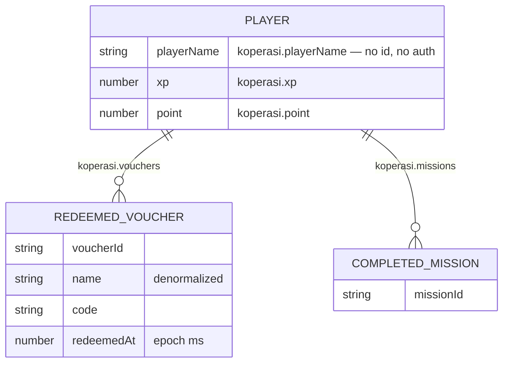

# Data Model — Koperasi Simulator (SIM-2)

Bridge documentation for the project's first database. Two diagrams: **AS-IS** (what
`localStorage` holds today) and **TARGET** (the Supabase/Postgres schema in this
`@simkop/db` package), plus a gap/mapping table. Rationale and decisions live in the
local plan (`docs/plans/2026-09-19-feat-supabase-data-model-schema-plan.md`, kept out of
git per repo convention); this file is the tracked reference.

- **Engine:** Supabase Postgres. **Write path:** `apps/web` direct via `supabase-js`,
  guarded by RLS. The voice backend (`apps/backend`) stays database-free.
- **Identity:** `public.profiles` is 1:1 with `auth.users` (guest via anonymous sign-in,
  or Google OAuth; a guest upgrades in place via `linkIdentity`, id preserved).
- **Level is derived** from XP (`level_from_xp()`), never stored.

## AS-IS — localStorage (today)

Anonymous, browser-local, lost across devices/clears. Keys under `koperasi.*`
(`apps/web/src/stores/game.store.ts`).

The scenario result (`AuditorResult`) is produced server-side and shown at end of
session, but **never persisted** — it lives only in transient `sessionStore` state.
Level and badges are **derived** in the UI from live signals, also not stored.

## TARGET — Supabase schema

12 tables (10 for SIM-2 + the SIM-5 `quiz_definition`/`quiz_completion` pair). Owner-only RLS
on user-scoped tables; public read on `*_definition` catalogs — **except** `mission_definition`
(reallife `redeem_code`) and `quiz_definition` (the `correct_index` answer key), both kept out of
clients behind a plain owner-privileged view (`mission_catalog` / `quiz_catalog`) that omits the
secret column. Session score is folded into `sessions` (written at start, finalized at end).

```mermaid
erDiagram
  AUTH_USERS ||--|| PROFILES : "1:1 (managed by Supabase Auth)"
  PROFILES ||--|| USER_PROGRESS : has
  PROFILES ||--o{ SESSIONS : plays
  SCENARIO_DEFINITION ||--o{ SESSIONS : typed_by
  PROFILES ||--o{ MISSION_COMPLETION : claims
  MISSION_DEFINITION ||--o{ MISSION_COMPLETION : completed_in
  PROFILES ||--o{ VOUCHER_REDEMPTION : redeems
  VOUCHER_DEFINITION ||--o{ VOUCHER_REDEMPTION : redeemed_as
  PROFILES ||--o{ USER_BADGE : earns
  BADGE_DEFINITION ||--o{ USER_BADGE : awarded_as
  PROFILES ||--o{ QUIZ_COMPLETION : answers
  QUIZ_DEFINITION ||--o{ QUIZ_COMPLETION : graded_against

  PROFILES {
    uuid id PK "→ auth.users.id"
    text display_name "≤16, nullable (← playerName)"
    timestamptz created_at
    timestamptz updated_at
  }
  USER_PROGRESS {
    uuid user_id PK "→ profiles.id"
    int xp "≥0 — level derived, not stored"
    int point "≥0"
    timestamptz reconciled_at "SIM-5: one-time local-import marker; null until migrated"
  }
  SESSIONS {
    uuid id PK
    uuid user_id FK
    text scenario_id FK
    timestamptz started_at "written at session start"
    timestamptz ended_at "null until ended"
    text trigger "CHECK manual|sinyal_level_1|force_quit_level_2; null until ended"
    text ending_type "CHECK good|bad|neutral; null until scored"
    jsonb scores_json "per-scenario rubric, 0-100"
    jsonb state_json "AuditorResult.stateClassification"
    text narrative_feedback
  }
  SCENARIO_DEFINITION {
    text code PK
    text title
    text difficulty
    text status "CHECK AVAILABLE|COMING_SOON"
  }
  MISSION_DEFINITION {
    text code PK
    text kind "CHECK game|reallife"
    int reward_xp
    int reward_point
    text redeem_code "soft KDMP gate code; reallife only; REVOKEd from clients"
  }
  MISSION_COMPLETION {
    bigint id PK
    uuid user_id FK
    text mission_id FK
    timestamptz completed_at
  }
  VOUCHER_DEFINITION {
    text code PK
    text name
    int cost
  }
  VOUCHER_REDEMPTION {
    bigint id PK
    uuid user_id FK
    text voucher_id FK
    text voucher_name "denormalized"
    text minted_code UK
    int cost_point
  }
  BADGE_DEFINITION {
    text code PK
    text title
    text icon "CHECK (9 icon kinds)"
    jsonb criteria "mirrors BadgeCriteria; null = teaser"
  }
  USER_BADGE {
    bigint id PK
    uuid user_id FK
    text badge_id FK
    timestamptz awarded_at "the new fact"
  }
  QUIZ_DEFINITION {
    text code PK
    text prompt
    jsonb options
    int correct_index "SIM-5: answer key — REVOKEd from clients (quiz_catalog view omits it)"
    text explanation "revealed post-answer by submit_quiz, never in the catalog view"
  }
  QUIZ_COMPLETION {
    uuid user_id PK "→ profiles.id"
    text question_code PK "→ quiz_definition.code"
    timestamptz first_correct_at "credit-once ledger; a question rewards at most once"
  }
```

**Not tables:** `level_from_xp(int)` is an `IMMUTABLE` function (thresholds
`[0,100,300,600,1000,1500]`, 1-based). `leaderboard(limit)` is a `SECURITY DEFINER`
function that publishes a bounded `display_name + xp + level` projection (owner-only RLS
would otherwise hide other players).

**Server-side integrity RPCs** (`SECURITY DEFINER`, `search_path=''`, `REVOKE EXECUTE FROM
public, anon` — anon gets EXECUTE via a *default privilege*, so `from public` alone is not
enough): `claim_mission` (validates the gate code server-side, credits reward atomically, idempotent
via `unique(user_id, mission_id)`), `redeem_voucher` (race-safe balance debit, mints a unique
code), `record_session_result` (finalizes an owned open session). `add_rewards` is a **private**
helper, never client-callable — as of SIM-5 it **returns the post-credit `{xp, point}`** so callers
reconcile in one round-trip. Badges are awarded by a plain RLS-guarded insert (idempotent via
`unique(user_id, badge_id)`); the earn rule stays client-side (cosmetic, client-trusted).

**SIM-5 progress RPCs** (same hardening): `submit_quiz(answers)` grades server-side and credits
only newly-correct questions once (answer key never leaves the DB); `get_my_progress()` returns the
whole wallet snapshot (progress + missions + vouchers + badges) in one call for boot hydrate;
`sync_badges(codes[])` batch-inserts newly-earned badges; `reconcile_local_progress(uid, xp,
missions)` imports a pre-existing local wallet **once** (atomic `reconciled_at` marker) — migrating
**xp + game-mission state only, never the spendable `point`**, since a fresh anonymous account is
indistinguishable from a returning player and a client-supplied balance is unauthenticatable.

## Gap / mapping

| AS-IS (localStorage) | TARGET | Notes |
|---|---|---|
| `koperasi.playerName` | `profiles.display_name` | **net-new** identity/id + auth (guest or Google) |
| `koperasi.xp` / `koperasi.point` | `user_progress.xp` / `.point` | 1:1 satellite; level derived |
| `koperasi.vouchers[]` | `voucher_redemption` | repeatable; `voucher_name` kept denormalized |
| `koperasi.missions[]` | `mission_completion` | `unique(user_id, mission_id)`; server-side `redeem_code` for reallife |
| (derived in UI) level | `level_from_xp()` | never a column |
| (derived in UI) badges | `badge_definition` + `user_badge.awarded_at` | **persisted** (SIM-5 wires it); `awarded_at` is the new fact |
| (FE-only quiz bank + client grading) | `quiz_definition` / `quiz_completion` + `submit_quiz` | **SIM-5**: answer key server-side, credit-once per question |
| (whole `koperasi.*` wallet, first login) | `reconcile_local_progress(uid, xp, missions)` | **SIM-5**: one-time import, xp + game-missions only (point/vouchers dropped) |
| (transient) `AuditorResult` | `sessions` (folded score columns) | transcript **not** persisted; row written at session start |
| FE static content arrays | `*_definition` tables | seeded from `@simkop/catalog` (shared package the FE also imports, CI parity-checked) |

### Net-new (nothing persists these today)
Identity/auth, `sessions` + score, `user_badge.awarded_at`, and the four `*_definition`
catalog tables (formerly FE-only arrays; the DB is now the source of truth, with the FE
and the seed both deriving from the shared `@simkop/catalog` package).

> **On the reallife codes:** `redeem_code` (`KDMP2026` etc.) is a *soft* gate — printed at
> the KDMP and typed by the player. It is **not** a cryptographic secret. The DB hides it
> (REVOKE + `mission_catalog` view) as defense-in-depth only; the same codes still ship in
> the client bundle today (see follow-up). Treat gate-code claims as best-effort, not anti-cheat.

## Follow-ups (out of scope for SIM-2 BE)
- ✅ FE integration: guest + Google auth (SIM-3); progress/quiz/badges wired to the RPCs and the
  one-time local import (SIM-5, PR #20). Remaining: writing the `sessions` row at start +
  `record_session_result` at end (the voice-session scoring path).
- **Stop shipping reallife codes in the client bundle** (they are still in `@simkop/catalog`,
  which the FE imports). If they must be non-guessable, mint high-entropy codes into an
  untracked source and enter them only via the KDMP, never bundle them. (Contrast: SIM-5's quiz
  `correct_index` *is* fully server-side — the pattern to follow if these codes ever need to be.)
- Enable Auth settings in the Supabase project: anonymous sign-ins, manual linking, Google
  provider, CAPTCHA/rate-limit on anonymous sign-in.
- `pg_cron` cleanup of stale anonymous users.
